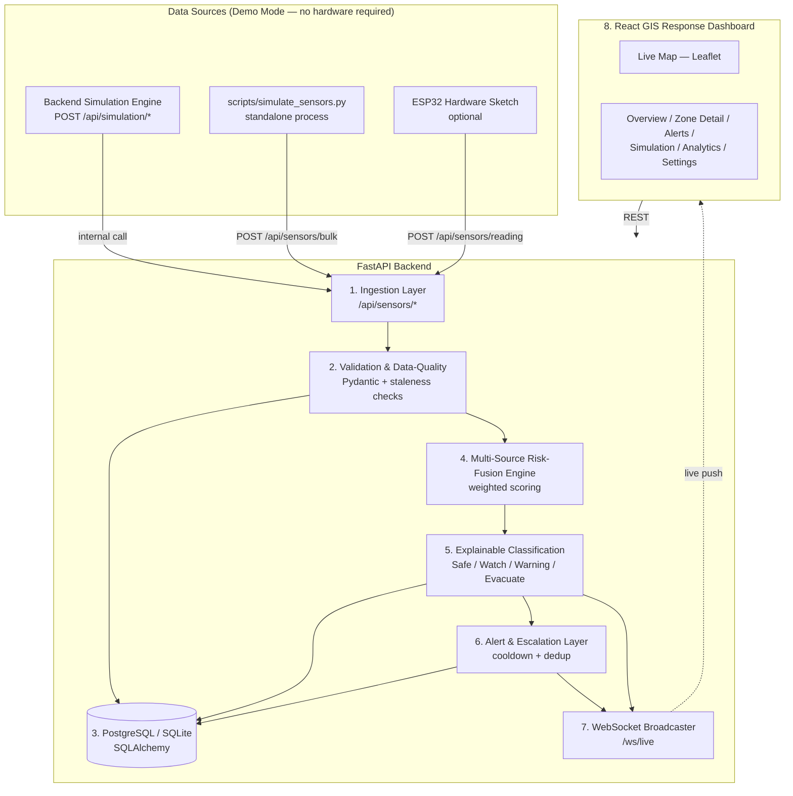
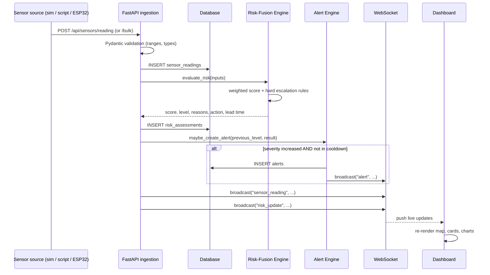
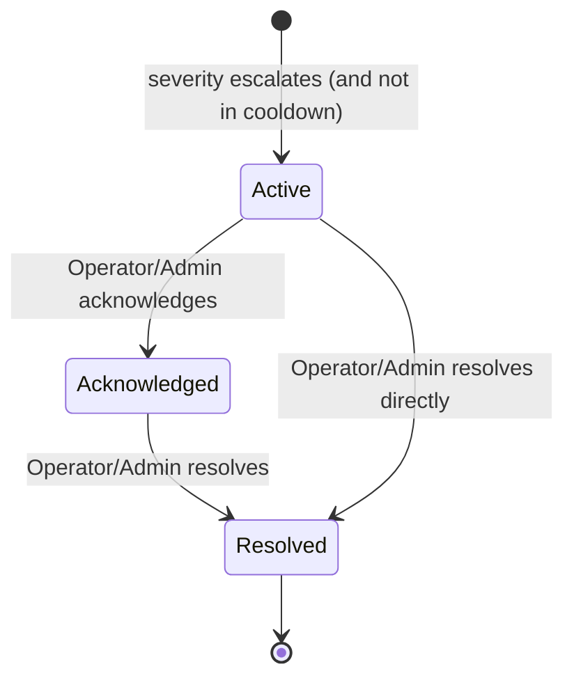
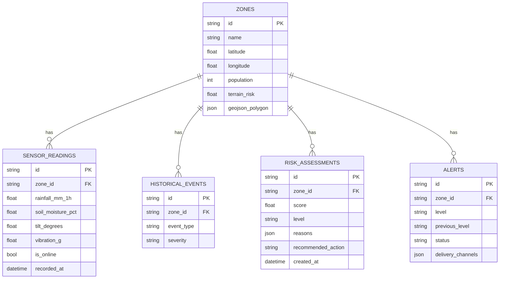

# HimalayaShield — Architecture

> Hackathon decision-support prototype. **Demo Mode — not for operational emergency decisions.**

## System overview



## Risk evaluation sequence (single reading)



## Risk-fusion formula

```
risk_score = 0.35 * rainfall_risk
           + 0.25 * soil_risk
           + 0.15 * tilt_risk
           + 0.10 * vibration_risk
           + 0.10 * terrain_risk
           + 0.05 * history_risk
```

Each sub-risk is normalized to 0–100. Classification:

| Score range | Level    |
|-------------|----------|
| 0–24        | Safe     |
| 25–49       | Watch    |
| 50–74       | Warning  |
| 75–100      | Evacuate |

### Hard escalation rules (override the weighted score's classification with a *minimum* level)

- `rainfall_3h >= 60mm` AND `soil_moisture >= 80%` → minimum **Warning**
- `rainfall_3h >= 80mm` AND `soil_moisture >= 85%` AND `tilt_change_rate >= 5°/hr` → minimum **Evacuate**
- `vibration_g >= 2.5g` (critical threshold) → minimum **Warning**
- Stale (>15 min old) or offline readings reduce confidence and add a data-quality warning, but do not change the level itself.

See `backend/app/risk_engine.py` for the full implementation.

## Alert lifecycle



An alert is only created when the new level is strictly higher than the zone's previous level (Safe→Watch, Watch→Warning, Warning→Evacuate, or any upward jump). A per-zone-per-level cooldown (`ALERT_COOLDOWN_SECONDS`, default 120s) prevents duplicate alerts from repeated readings at the same level.

## Data model (ER overview)



## Why these design choices

- **SQLite by default, PostgreSQL via `DATABASE_URL`**: the demo needs to run with zero setup; Docker Compose / Supabase swap in PostgreSQL without code changes.
- **Simulation runs inside the FastAPI process** (`asyncio` background task) so the primary demo needs no extra process — `scripts/simulate_sensors.py` is provided as an alternative for running the simulator externally (e.g. against a deployed backend).
- **Hard escalation rules alongside the weighted score** keep the system explainable and conservative: a single dangerous signal (e.g. critical vibration) can force a minimum level even if the blended score alone wouldn't.
- **Cooldown-based alerting** avoids alert fatigue from noisy sensors while still catching every genuine escalation.
